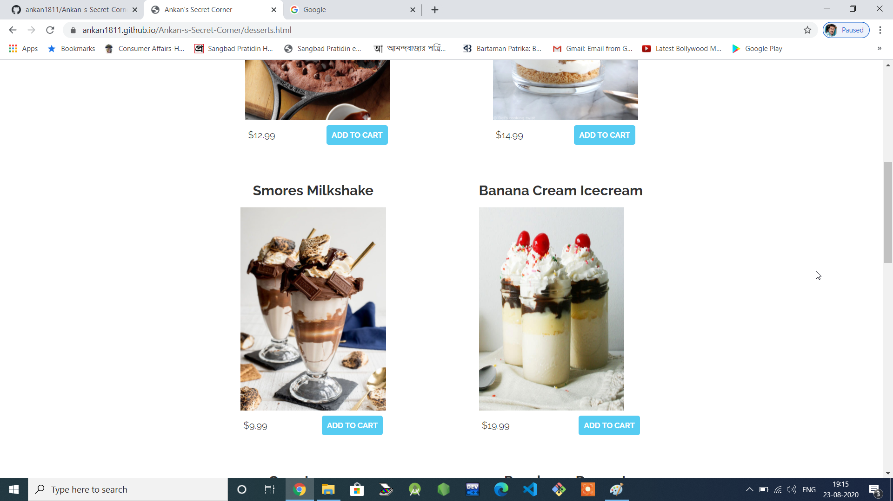

   # Ankan-s-Secret-Corner

# Link: https://ankan1811.github.io/Ankan-s-Secret-Corner/

One of the best restaurant websites in the modern time consisting of all the possible features.It consists of various menus including specials.It uses google maps,cart system made by javascript,contact form for feedback sent directly to email made using google sheets and many more amazing features.
# Some unique features of my Website:

### 1. Star Studded Satisfaction in the Menu:

The menu consists of mostly all cuisines.Here there are 6 cuisines:

1.Indian 

2.Chinese

3.Italian

4.Mexican

5.Japanese

6.Desserts

#### Fig1.Indian

#### Fig2.Chinese

Every cuisine has a beutiful envelope type menu system.It has specially been designed for the convenience of the customers.

### 2.Add to Cart System with proper Price:

Here every item can be added to the cart before the customer makes the decision of buying them.
This is a very useful feature.

### 3.A very sophisticated Cart Sytsem:

In the cart Sytsem, any item can be added any number of times.

It is made by javascript.

The quantity of the items can be varied.

The total price will be displayed at the bottom.

### 4.Live Location on Google Map

The live Location of the restaurant is available on google map which can be displayed anytime anywhere.

### 5.Contact form for any recommendations from the customer sent directly to my email:

As usual Customers are our biggest priorities.
We will always work upon any recommendations or suggestions from them.

### 6.Anyone can follow me(Ankan Pal,The creator)

Anyone is free to follow me on github,Linkedin or Facebook.

##### Thank you !!!
